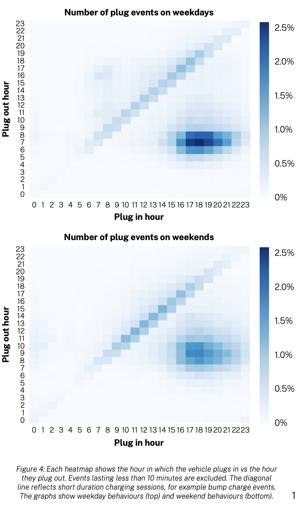
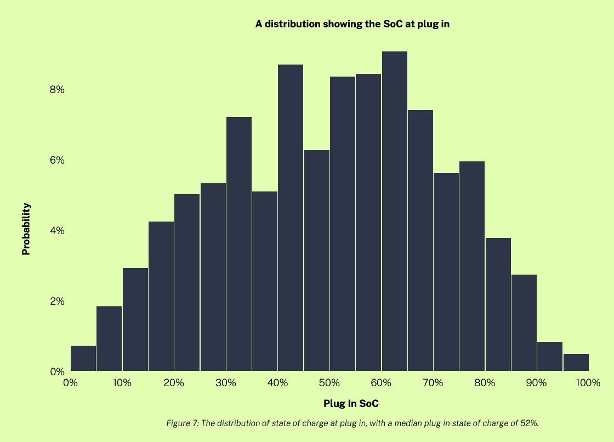
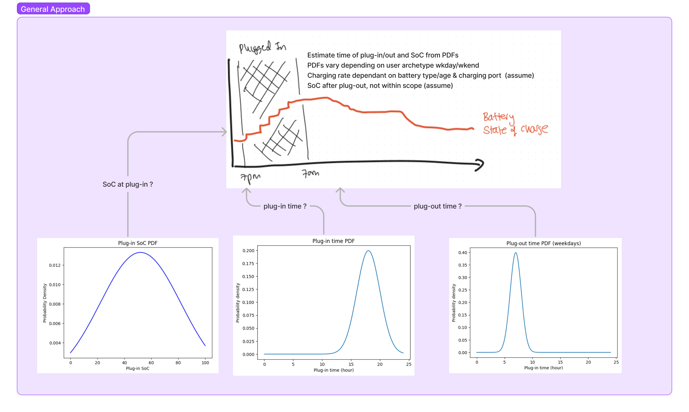

# EV Driver Behavior

Build an simulator of EV driver behaviour.

## Details

The simulator should be able to return:
- when somebody is plugged in
- the state of charge of the battery when they plug in
- it should be “agent-based” in the sense that it allows for modelling of individual user behaviour
- we should be able to use the simulator to recapitulate population-level observations. This might look like a script which runs the simulator with a bunch of preset parameters, for instance representing different archetypes of user behaviour (e.g. the “commute every day” vs. “mostly long trips at weekends”)

### Thoughts ...

The focus here is on predicting when a user will be plugged in and the state of the battery when they are plugged in. In the table in section [Types of User](#types-of-user), the majority user-type is 'Average (UK)', this user type has an average plug-in time of 6pm & plug-out time of 7am with an average plug-in SoC of 68%. On a 7 kW charger, this would take 1 hour to charge to 80% SoC or 2.7 hours to charge to 100% SoC assuming a linear charging rate.

For each of the above metrics, the plug-in/out time and plug-in SoC, there will be some distribution around the average. [Reference](#references) [1] provides some data on the distribution of plug-in/out times for the 'Intelligent Octopus' customers.

The distribution of plug-in/out times is shown below:

The distribution of plug-in SoC is shown below:

These distributions can act as a probability density functions (PDFs) and modelling the user behaviour can be done by sampling from these distributions. Using a randomly generated number between 0 and 1, we can sample from the Cumulative Density Function (CDF) to get a plug-in/out time or plug-in SoC - this is a type of Monte Carlo Simulation known as [Inverse Transform Sampling](https://towardsdatascience.com/understanding-monte-carlo-simulation-eceb4c9cad4). [References](#references) [5-6] use this method to model EV charging behavior.

General approach:

#### Assumptions

In the interest of time, we can assume the following from the above distributions.

- Plug-in/out times are normally distributed with a mean of 6pm (or as per the table below) and standard deviation of 2 hours. The standard deviation does not change between weekdays and weekends.
- SoC at plug-in is normally distributed with a mean of 68% (or as per the table below) and standard deviation of 20%.

## Types of User

| # | Name                        | % of population | Miles/yr | Battery (kWh) | Efficiency (mi/kWh) | Plug-in frequency (per day) | Charger kW | Plug-in time | Plug-out time | Target SoC | kWh/year | kWh/plug-in | Plug-in SoC | SoC requirement | Charging duration (hrs) |
| - | --------------------------- | --------------- | -------- | ------------- | ------------------- | --------------------------- | ---------- | ------------ | ------------- | ---------- | -------- | ----------- | ----------- | --------------- | ----------------------- |
| 1 | Average (UK)                | 40              | 9435     | 60            | 3.5                 | 1                           | 7          | 6:00 PM      | 7:00 AM       | 80%        | 2696     | 7           | 68%         | 12%             | 1                       |
| 2 | Intelligent Octopus average | 30              | 28105    | 72.5          | 3.5                 | 1                           | 7          | 6:00 PM      | 7:00 AM       | 80%        | 8030     | 22          | 52%         | 28%             | 2.5                     |
| 3 | Infrequent charging         | 10              | 9435     | 60            | 3.5                 | 0.2                         | 7          | 6:00 PM      | 7:00 AM       | 80%        | 2696     | 37          | 18%         | 62%             | 5                       |
| 4 | Infrequent driving          | 10              | 5700     | 60            | 3.5                 | 1                           | 7          | 6:00 PM      | 7:00 AM       | 80%        | 1629     | 4           | 73%         | 7%              | 1                       |
| 5 | Scheduled charging          | 9               | 9435     | 60            | 3.5                 | 1                           | 7          | 10:00 PM     | 9:00 AM       | 80%        | 2696     | 7           | 68%         | 12%             | 1                       |
| 6 | Always plugged-in           | 1               | 9435     | 60            | 3.5                 | 1                           | 7          | 12:00 AM     | 11:59 PM      | 80%        | 2696     | 7           | 68%         | 12%             | 1                       |

## References

1. [Octopus’ Centre for Net Zero.](https://www.centrefornetzero.org/wp-content/uploads/2022/05/Intelligent-Octopus-CNZ-Report-May-2022.pdf)
2. [Electric Vehicle Charging Sessions Generator Based on Clustered Driver Behaviors](https://www.mdpi.com/2032-6653/14/2/37)
3. [Simulation of electric vehicle driver behaviour in road transport and electric power networks](https://www.sciencedirect.com/science/article/pii/S0968090X17301341)
4. [The Coordinated Operation of Vertically Structured Power Systems for Electric Vehicle Charge Scheduling](https://www.researchgate.net/publication/357247033_The_Coordinated_Operation_of_Vertically_Structured_Power_Systems_for_Electric_Vehicle_Charge_Scheduling)
5. [Monte Carlo simulation of electric vehicle loads respect to return home from work and impacts to the low voltage side of distribution network](https://link.springer.com/article/10.1007/s00202-020-01093-5)
6. [Multi-type electric vehicle load prediction based on Monte Carlo simulation](https://www.sciencedirect.com/science/article/pii/S2352484722011106)