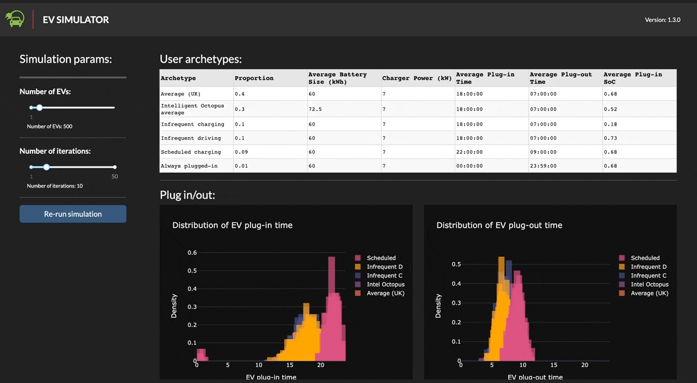

# EV Plug-in Simulator

Electrical Vehicle Plug-in and State of Charge Simulator.

## Description

This is a basic monte carlo simulation of EV charging behaviour, as based on a range of Archetype profiles. See [`NOTES.md`](NOTES.md) for more details.

## App

When running, can select the number of EVs in simulation and the number of iterations to perform. The app will then run the simulation and display the distributions of plug-in/out time and the SoC when plugged in. These results are then aggregated to form the Proportion of cars plugged in and their SoC.

### Running the App

See `ev_sim/app/README.md` for instructions on running the app locally or in Docker.

## Notes

See `NOTES.md` for notes on the analysis and the `notebooks` directory for messy exploration bits and bobs.

